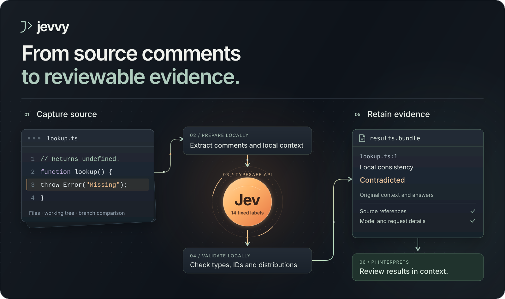

# jevvy

jevvy is a [Pi](https://github.com/earendil-works/pi) extension that uses
[Jev](https://docs.typesafe.ai/) to review comments, functions and tests. Each pack
asks fixed questions and returns the answers with their source evidence. Pi can
inspect that evidence before recommending changes. Jevvy scans leave source files
unchanged.

Source parsing supports JavaScript/JSX, TypeScript/TSX, Rust, Python and Solidity.
The Functions and Tests packs adapt [Kiln Code Savers](docs/packs.md#source-and-license)
rubrics for unnecessary complexity and tests of application-owned behavior.
They also include narrow checks developed through live Jev experiments.



## Install

Requires Pi and Node 26 on macOS or glibc Linux, ARM64 or x64.
See [tested environments](docs/verification.md#platform-and-host) for platform coverage.

```sh
pi install npm:jevvy
cd /path/to/your/project
pi
```

Restart an existing Pi session after installation. Add `-l` to the install
command to install only for the current project.

To install from Git instead, use `pi install git:github.com/timbrinded/jevvy`.

In Pi, preview the comments affected by your working changes:

```text
/jevvy comments --working --dry-run
```

A dry-run shows the selected comments and planned requests without API calls or
an API key. For live analysis, set `TYPESAFE_API_KEY` in your shell before
starting Pi, then omit `--dry-run`. Requests use your TypeSafe account.

## Scan comments

| Scope | Command |
| --- | --- |
| Named files | `/jevvy comments --files src/example.ts src/other.ts` |
| Working changes | `/jevvy comments --working` |
| Branch changes | `/jevvy comments --base origin/master --head HEAD` |

File paths are relative to Pi's working directory. Working scans compare against
HEAD and include non-ignored untracked files. Branch scans compare the base/head
merge-base with head; replace `origin/master` with your base branch.

Diff scans include unchanged comments attached to changed code. A clean working
tree has no changes to review; use `--files` to scan existing files. Add
`--dry-run` to any scan to preview it, or use `/jevvy cancel` to stop a running scan.

## Scan functions and tests

```text
/jevvy functions --files src/orders.ts
/jevvy tests --files test/orders.test.ts --context-files src/orders.ts package.json
```

Both packs also support `--working`, `--base <ref> [--head <ref>]`, and `--dry-run`.
Supporting files are explicit: include the relevant implementation, manifest and
contract so a test can be assessed against the behavior it protects. They are
captured from the selected snapshot and subject to the context budget. Missing
evidence remains visible; Jevvy does not infer a complete call graph or test suite.
See [pack rubrics and limits](docs/packs.md).

## Read results

Each scan saves a **bundle** containing the assessments and the source used to
make them. The result card shows coverage, errors and the bundle ID. Completed
answers remain available after cancellation or failures in other requests.

Open the inspector to browse selected units, saved source and question definitions:

```text
/jevvy inspect <bundle-id>
```

Left and right change pages, up and down scroll, and Tab switches views. Escape
or your configured Pi cancel key closes the inspector.

Retrieve an overview or a page of comments:

```text
/jevvy results <bundle-id>
/jevvy results <bundle-id> --view units --limit 5
```

Pi can also use `jevvy_comments`, `jevvy_functions`, `jevvy_tests`, and
`jevvy_results`. Reading saved results makes no API calls. See the
[sample report](examples/jevvy-results.example.md) for the output format; its
values are synthetic.

For a code-pack result, select a question and rank its `issue` outcome:

```text
/jevvy results <bundle-id> --view units --labels owned_behavior --sort owned_behavior --outcome issue --min-probability 0.8 --min-confidence 0.7 --include-context --include-definitions
```

Those cutoffs are example review settings, not calibrated accuracy guarantees.
Filters operate on saved answers. The full distributions, unknown outcomes and
unfiltered results remain available. A scan that raises no candidate does not
establish that the code or tests are correct.

## Data and settings

Live scans send selected units and their bound context to TypeSafe. Context
can include an entire small file. Reports and retrieved code enter Pi's model
conversation. Bundles store full captured files locally so results retain the
source as it was when scanned.

Bundles and cached answers are stored in `~/.cache/jevvy`. Set `JEVVY_STORAGE_DIR`
to change this location; keep it outside tracked project files. Saving a new
bundle removes results and cached answers older than 30 days by default.

For other settings, set `JEVVY_CONFIG` to a JSON object that overrides the
[configuration defaults](src/config.ts).

## Development

Use the Node version in [.node-version](.node-version) and the pnpm version in
[package.json](package.json). TypeScript 7 checks types and builds the library;
Node runs the tests directly.

```sh
git clone https://github.com/timbrinded/jevvy.git
cd jevvy
pnpm install --frozen-lockfile
pnpm run check
pnpm run smoke
pnpm exec pi install .
```

`check` runs formatting, lint, typecheck, tests and build. `smoke` checks Pi
integration. Neither makes paid API calls. Use `pnpm run smoke:live` with
`TYPESAFE_API_KEY` for a live check.

The last command registers the checkout as a local Pi package. Restart Pi after
source edits.

- [Release guide](docs/releasing.md): Pi discovery, npm packaging and publication.
- [Functions and Tests](docs/packs.md): rubrics, evidence requirements and Kiln attribution.
- [Verification](docs/verification.md): test coverage and detailed checks.
- [Bundle contract](docs/contracts.md): schemas, validation and retrieval rules.

## License

[Apache-2.0](LICENSE). Separate third-party notices apply to the
[Solidity grammar](native/solidity/LICENSE) and
[adapted Codesavers material](docs/packs.md#source-and-license).
